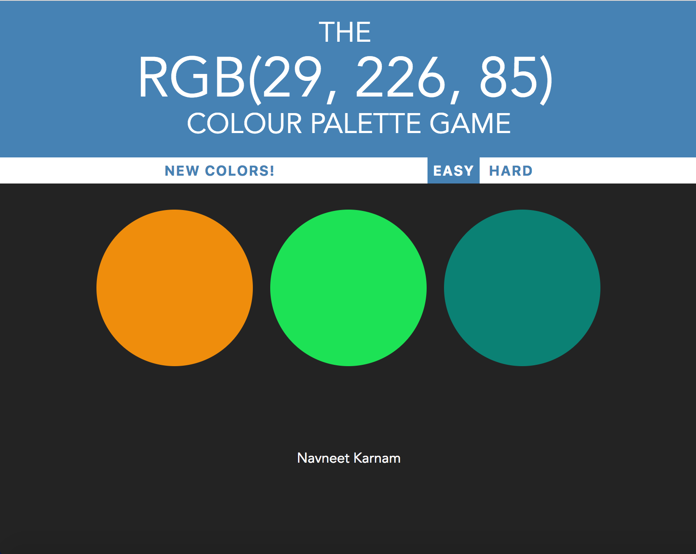

# ColourMe.io
* * *
### A simple fun color game
* * *
### Instructions
- Try and match the color code with the colors in the palette.
- Each time a wrong color is clicked it vanishes.
- Clicking on the right color changes the color in all the palette to the right color.
- The game can be played in two modes: 
  * Easy mode (3 Palettes)
  * Hard mode (6 Palettes)
* * *

#### Tools used:
- HTML5
- CSS3
- JavaScript 
- Bootstrapping
- Webkit is used to make it compatible with all the browsers out there.

* * *
### Hard Mode:

* * *
### Easy Mode:

* * * 
### Color dissappearing when the wrong color is clicked!
 
